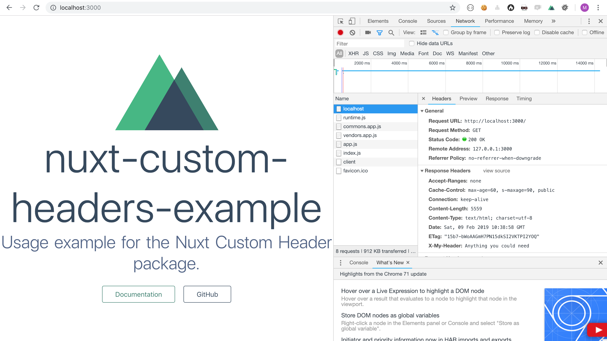

# nuxt-custom-headers-example

> Usage example for the [Nuxt Custom Header](https://www.npmjs.com/package/nuxt-custom-headers) package.

## How to install nuxt-custom-headers ?

Everything is in the last commit of this repo.

### Install the package

```bash
yarn add nuxt-custom-headers
```

### Enable the module

In the `nuxt.config.js`, add the module name to the loaded modules:

```javascript
  /*
  ** Nuxt.js modules
  */
  modules: [
    'nuxt-custom-headers',
  ],
```

### Add Headers to your page

In your page component, add a function named `httpHeaders` to the script part:

```javascript
export default {
  components: {
    Logo
  },
  httpHeaders: () => ({
    'Cache-Control': 'max-age=60, s-maxage=90, public',
    'X-My-Header': 'Anything you could need'
  })
}
```

### And see the result

You can see in this screenshot the custom headers `Cache-Control` and `X-My-Header` in the response headers.



## Build Setup

``` bash
# install dependencies
$ yarn install

# serve with hot reload at localhost:3000
$ yarn run dev

# build for production and launch server
$ yarn run build
$ yarn start

# generate static project
$ yarn run generate
```

For detailed explanation on how things work, checkout [Nuxt.js docs](https://nuxtjs.org).

